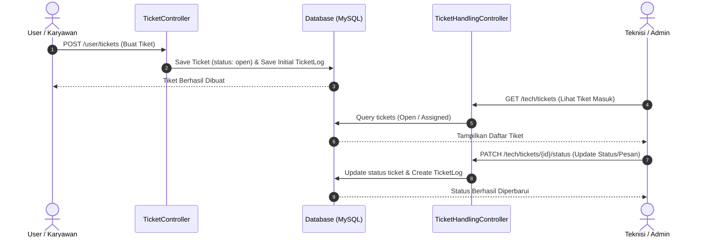
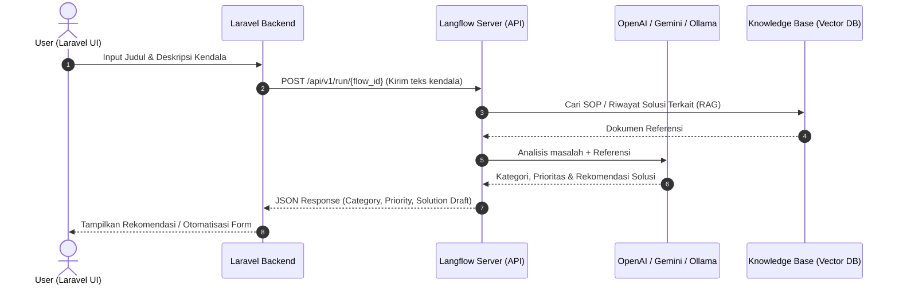

# Chat Conversation

Note: _This is purely the output of the chat conversation and does not contain any raw data, codebase snippets, etc. used to generate the output._

### User Input

Tolong jelaskan alur code backend dari project ini seperi CRUD nya agar saya menegrti

*Listed directory [Controllers](file:///c:/laragon/www/project-kerja-praktik/app/Http/Controllers) *

*Listed directory [User](file:///c:/laragon/www/project-kerja-praktik/app/Http/Controllers/User) *

*Listed directory [Tech](file:///c:/laragon/www/project-kerja-praktik/app/Http/Controllers/Tech) *

*Listed directory [routes](file:///c:/laragon/www/project-kerja-praktik/routes) *

*Listed directory [Models](file:///c:/laragon/www/project-kerja-praktik/app/Models) *

*Viewed [web.php](file:///c:/laragon/www/project-kerja-praktik/routes/web.php) *

*Viewed [TicketController.php](file:///c:/laragon/www/project-kerja-praktik/app/Http/Controllers/User/TicketController.php) *

*Viewed [TicketHandlingController.php](file:///c:/laragon/www/project-kerja-praktik/app/Http/Controllers/Tech/TicketHandlingController.php) *

*Viewed [Ticket.php](file:///c:/laragon/www/project-kerja-praktik/app/Models/Ticket.php) *

*Viewed [RoleMiddleware.php](file:///c:/laragon/www/project-kerja-praktik/app/Http/Middleware/RoleMiddleware.php) *

### Planner Response

Berikut adalah penjelasan lengkap mengenai **alur arsitektur backend** dan **operasi CRUD (Create, Read, Update, Delete)** pada project Helpdesk / Ticket Tracking System ini.

Project ini dibangun menggunakan framework **Laravel** dengan arsitektur **MVC (Model-View-Controller)** dan sistem otorisasi berbasis peran (*role-based access control*).

---

### 1. Routing & Hak Akses (Role-Based Middleware)

Semua rute backend didefinisikan di file [web.php](file:///c:/laragon/www/project-kerja-praktik/routes/web.php). Akses dibatasi menggunakan `RoleMiddleware` ([RoleMiddleware.php](file:///c:/laragon/www/project-kerja-praktik/app/Http/Middleware/RoleMiddleware.php#L17-L27)) untuk memisahkan hak akses sesuai peran pengguna:

*   **Role User (`role:user`)**: Hanya bisa mengakses rute berawalan `/user/` untuk membuat tiket, melihat tiket milik sendiri, dan memberikan balasan.
*   **Role Teknisi & Admin (`role:technician,admin`)**: Mengakses rute `/tech/` untuk melihat tiket masuk dan memperbarui status tiket.
*   **Role Admin (`role:admin`)**: Mengakses rute khusus `/admin/` untuk menugaskan teknisi ke tiket tertentu (`assignTechnician`).

---

### 2. Struktur Data & Relasi Model

Aplikasi ini berpusat pada entity **Ticket** yang terhubung dengan beberapa tabel lain melalui Eloquent Relationship ([Ticket.php](file:///c:/laragon/www/project-kerja-praktik/app/Models/Ticket.php)):

*   **User (`user_id`)**: Pembuat/pelapor tiket ([Ticket.php:L26-L29](file:///c:/laragon/www/project-kerja-praktik/app/Models/Ticket.php#L26-L29)).
*   **Category (`category_id`)**: Kategori kendala ([Ticket.php:L31-L34](file:///c:/laragon/www/project-kerja-praktik/app/Models/Ticket.php#L31-L34)).
*   **Technician (`technician_id`)**: Teknisi yang ditunjuk untuk menangani tiket ([Ticket.php:L36-L39](file:///c:/laragon/www/project-kerja-praktik/app/Models/Ticket.php#L36-L39)).
*   **TicketLog (`logs`)**: Riwayat aktivitas, perubahan status, dan obrolan/diskusi pada tiket ([Ticket.php:L41-L44](file:///c:/laragon/www/project-kerja-praktik/app/Models/Ticket.php#L41-L44)).

---

### 3. Alur Operasi CRUD & Diskusi Tiket

#### A. CREATE (Membuat Tiket Baru)
Proses pembuatan tiket baru diakses oleh User/Karyawan:
1.  **Form Input**: Method `create()` pada [TicketController.php:L54-L58](file:///c:/laragon/www/project-kerja-praktik/app/Http/Controllers/User/TicketController.php#L54-L58) mengambil daftar kategori dari database untuk ditampilkan di form.
2.  **Proses Simpan (`store`)** pada [TicketController.php:L61-L102](file:///c:/laragon/www/project-kerja-praktik/app/Http/Controllers/User/TicketController.php#L61-L102):
    *   **Validasi**: Memastikan kategori ada, judul & deskripsi diisi, serta file lampiran berupa gambar (maksimal 2MB).
    *   **Upload File**: Jika ada lampiran gambar, file disimpan ke `storage/app/public/tickets`.
    *   **Generate Kode Tiket**: Menggenerate kode unik otomatis seperti `TCK-20260901-A1B2`.
    *   **Insert Tiket**: Menyimpan data tiket baru ke tabel `tickets` dengan status default `open`.
    *   **Audit Log**: Otomatis mencatat entry pertama di tabel `ticket_logs` untuk melacak saat tiket pertama kali dibuat.

#### B. READ (Melihat & Menampilkan Tiket)
*   **Daftar Tiket User**: Method `index()` di [TicketController.php:L15-L23](file:///c:/laragon/www/project-kerja-praktik/app/Http/Controllers/User/TicketController.php#L15-L23) mengambil tiket yang dibuat oleh user yang sedang login (`where('user_id', auth()->id())`) menggunakan Eager Loading (`with(['category', 'technician', 'logs.user'])`) agar query efisien.
*   **Daftar Tiket Teknisi/Admin**: Method `index()` di [TicketHandlingController.php:L14-L34](file:///c:/laragon/www/project-kerja-praktik/app/Http/Controllers/Tech/TicketHandlingController.php#L14-L34) menampilkan semua tiket. Bagi teknisi, hanya tiket yang *unassigned* (`technician_id IS NULL`) atau yang *assigned* kepadanya yang akan muncul.
*   **Detail Tiket**: Method `show()` pada kedua controller menampilkan data spesifik tiket beserta seluruh riwayat percakapan/log penangannya.

#### C. UPDATE (Memperbarui Tiket & Penugasan)
Update pada sistem ini terbagi menjadi 3 jenis tindakan:
1.  **Balasan/Tanggapan User**: Method `reply()` di [TicketController.php:L36-L51](file:///c:/laragon/www/project-kerja-praktik/app/Http/Controllers/User/TicketController.php#L36-L51) menambahkan percakapan/catatan baru pengguna ke tabel `ticket_logs`.
2.  **Update Status oleh Teknisi**: Method `updateStatus()` di [TicketHandlingController.php:L46-L78](file:///c:/laragon/www/project-kerja-praktik/app/Http/Controllers/Tech/TicketHandlingController.php#L46-L78) mengubah status tiket (`open`, `in_progress`, `resolved`, `closed`). Jika teknisi memperbarui tiket yang belum ada penanggung jawabnya, sistem akan otomatis menetapkan teknisi tersebut sebagai PJ tiket (`auto-assign`).
3.  **Penugasan Teknisi oleh Admin**: Method `assignTechnician()` di [TicketHandlingController.php:L80-L118](file:///c:/laragon/www/project-kerja-praktik/app/Http/Controllers/Tech/TicketHandlingController.php#L80-L118) memungkinkan Admin menunjuk teknisi mana yang bertugas. Jika status tiket masih `open`, statusnya otomatis berubah menjadi `in_progress` dan perubahan dicatat ke `ticket_logs`.

#### D. DELETE (Penutupan / Soft Handling)
Dalam sistem ticket tracking / helpdesk professional, data tiket umumnya **tidak dihapus permanen** (*hard delete*) untuk kebutuhan histori audit. Sebagai gantinya, pengerjaan tiket diselesaikan dengan mengubah `status` tiket menjadi `resolved` atau `closed` via `updateStatus()`.

---

### Ringkasan Alur Data (Flow Chart Singkat)



### User Input

menrutmu dalam proyek ini apakah bisa di aplikasikan/implementasi langflow atau AI?

*Viewed [TicketHandlingController.php](file:///c:/laragon/www/project-kerja-praktik/app/Http/Controllers/Tech/TicketHandlingController.php) *

### Planner Response

**Tentu saja SANGAT BISA dan SANGAT RELEVAN!** 

Sistem *Helpdesk / Ticket Tracking* adalah salah satu *use case* paling populer dan bermanfaat untuk diintegrasikan dengan **AI / Langflow**. 

Dengan menambahkan AI, sistem helpdesk Anda tidak lagi sekadar menjadi tempat penampung formulir kendala (*form catcher*), melainkan berubah menjadi **Sistem Cerdas (Smart Helpdesk)** yang dapat menghemat waktu pengguna maupun teknisi.

---

### 🚀 5 Ide Implementasi AI & Langflow pada Project Ini

#### 1. Auto-Categorization & Priority Analysis (Klasifikasi Tiket Otomatis)
*   **Masalah Saat Ini**: User bisa saja salah memilih kategori atau kebingungan memilih tingkat urgensi (*low, medium, high, urgent*) saat mengisi [TicketController.php:L61-L102](file:///c:/laragon/www/project-kerja-praktik/app/Http/Controllers/User/TicketController.php#L61-L102).
*   **Solusi AI/Langflow**:
    *   Saat user mengetik judul dan deskripsi masalah, kirim teks tersebut ke API Langflow.
    *   Langflow akan menganalisis teks menggunakan LLM (seperti GPT/Gemini/Ollama) dan secara otomatis merekomendasikan **Kategori** serta **Prioritas** yang tepat.

#### 2. AI Chatbot / First-Line Support (Pencegahan Buat Tiket / Self-Service)
*   **Masalah Saat Ini**: Banyak masalah sepele (seperti *"Lupa Password Wi-Fi"*, *"Printer Tidak Terdeteksi"*) yang sebenarnya bisa diselesaikan sendiri oleh user tanpa harus mengganggu teknisi.
*   **Solusi AI/Langflow**:
    *   Sebelum form pembuat tiket disubmit, tampilkan AI Assistant.
    *   AI mencari jawaban dari **Knowledge Base / Dokumen SOP Perusahaan** (menggunakan teknik **RAG - Retrieval-Augmented Generation** di Langflow).
    *   Jika AI berhasil membantu user, tiket tidak perlu dibuat. Jika belum tuntas, AI otomatis mengubah percakapan menjadi tiket baru.

#### 3. Smart Solution Draft untuk Teknisi (Asisten Teknisi)
*   **Masalah Saat Ini**: Teknisi di [TicketHandlingController.php:L37-L43](file:///c:/laragon/www/project-kerja-praktik/app/Http/Controllers/Tech/TicketHandlingController.php#L37-L43) harus berpikir dan mengetik manual dari nol setiap kali ada tiket masuk.
*   **Solusi AI/Langflow**:
    *   Saat teknisi membuka detail tiket, AI akan membaca riwayat tiket-tiket serupa yang pernah selesai di masa lalu (*history log*).
    *   AI memberikan tombol: **"✨ Generate Draf Solusi"** yang memuat langkah-langkah *troubleshooting* awal yang direkomendasikan untuk dibalas ke user.

#### 4. Smart Auto-Assignment (Penugasan Teknisi Otomatis)
*   **Masalah Saat Ini**: Admin harus menugaskan teknisi secara manual melalui `assignTechnician()` di [TicketHandlingController.php:L80-L118](file:///c:/laragon/www/project-kerja-praktik/app/Http/Controllers/Tech/TicketHandlingController.php#L80-L118).
*   **Solusi AI/Langflow**:
    *   Langflow dapat menganalisis bidang keahlian teknisi (misal: Jaringan vs Hardware vs Software) serta *workload* tiket yang sedang aktif.
    *   AI merekomendasikan atau langsung menugaskan tiket ke teknisi yang paling cocok.

#### 5. Ringkasan Tiket & Analisis Sentimen (Ticket Summarization)
*   **Masalah Saat Ini**: Jika tiket memiliki diskusi/log yang sangat panjang di `TicketLog`, teknisi butuh waktu membaca dari awal.
*   **Solusi AI/Langflow**:
    *   AI membuat **Ringkasan 2 Kalimat** mengenai inti masalah dan poin diskusi terakhir.
    *   AI mendeteksi sentimen user (misal: "User Sangat Kecewa / Emosi") sehingga tiket bisa di-escalate menjadi prioritas *Urgent*.

---

### 🛠️ Mengapa Menggunakan **Langflow** untuk Project Laravel Ini?

**Langflow** sangat cocok dipadukan dengan Laravel karena:
1.  **Visual Workflow (No-Code/Low-Code)**: Anda bisa merancang logika RAG, *prompt engineering*, dan pemilihan model AI (Gemini, OpenAI, Llama 3) secara visual tanpa harus mengubah banyak kode PHP.
2.  **Expose REST API**: Setiap *flow* yang dibuat di Langflow dapat di-publish menjadi **Endpoint API HTTP**.
3.  **Kemudahan Integrasi di Laravel**: Laravel hanya perlu memanggil API Langflow menggunakan facade `Illuminate\Support\Facades\Http`.

---

### 📊 Gambaran Alur Arsitektur Integrasi



---

### 💡 Kesimpulan & Saran Implementasi

Jika Anda ingin menjadikan project ini sebagai **Tugas Akhir / Kerja Praktik / Portfolio unggulan**, mengimplementasikan Langflow akan memberi **nilai tambah (point plus) yang sangat tinggi**.

**Langkah Awal yang Paling Mudah Dicoba:**
1.  Instal **Langflow** (bisa via `pip install langflow` atau Docker).
2.  Buat Flow sederhana di Langflow: `Prompt` -> `LLM` -> `JSON Output` (untuk auto-categorize & priority).
3.  Panggil API Langflow tersebut dari method `store()` di [TicketController.php](file:///c:/laragon/www/project-kerja-praktik/app/Http/Controllers/User/TicketController.php#L61-L102).

### User Input

apakah projek saya bisa menngunakan ui atau design dari stitch google?

*Listed directory [views](file:///c:/laragon/www/project-kerja-praktik/resources/views) *

*Viewed [app.blade.php](file:///c:/laragon/www/project-kerja-praktik/resources/views/layouts/app.blade.php) *

### Planner Response

**Tentu saja SANGAT BISA! (100% Kompatibel)** 

Project Anda saat ini menggunakan **Laravel Blade Templates** yang dipadukan dengan **Tailwind CSS** dan **Vite** (bisa dilihat di file [app.blade.php:L17](file:///c:/laragon/www/project-kerja-praktik/resources/views/layouts/app.blade.php#L17)). 

Karena **Google Stitch** menghasilkan output berupa struktur **HTML & Tailwind CSS**, Anda dapat dengan sangat mudah mengadopsi desain UI dari Google Stitch ke dalam project Laravel ini.

---

### 🛠️ Cara Mengintegrasikan Desain Google Stitch ke Project Laravel Anda

#### Langkah 1: Export / Copy Kode dari Google Stitch
Setelah Anda selesai merancang atau men-generate tampilan UI (misalnya halaman Dashboard, Tabel Tiket, atau Form Tiket) di Google Stitch, copy kode **HTML / Tailwind CSS** yang dihasilkan.

#### Langkah 2: Pisahkan Menjadi Layout & Komponen Blade
Buka folder UI Anda di [resources/views/](file:///c:/laragon/www/project-kerja-praktik/resources/views):

1.  **Layout Utama / Navbar / Sidebar**:
    *   Tempelkan (*paste*) struktur navigasi atau layout utama dari Stitch ke file [layouts/app.blade.php](file:///c:/laragon/www/project-kerja-praktik/resources/views/layouts/app.blade.php) atau [layouts/navigation.blade.php](file:///c:/laragon/www/project-kerja-praktik/resources/views/layouts/navigation.blade.php).
2.  **Halaman Spesifik**:
    *   **Form Buat Tiket**: Tempelkan komponen form ke `resources/views/user/tickets/create.blade.php`.
    *   **Tabel Daftar Tiket**: Tempelkan komponen tabel/card ke `resources/views/user/tickets/index.blade.php` atau `resources/views/tech/tickets/index.blade.php`.
    *   **Detail Tiket & Chat Log**: Tempelkan komponen timeline/chat ke `resources/views/tech/tickets/show.blade.php`.

#### Langkah 3: Hubungkan dengan Variable & Directive Laravel Blade
Ganti teks statis dari HTML Stitch dengan tag dinamis Laravel Blade.

**Contoh Perbandingan:**

*   *Sebelum (HTML Statis dari Stitch):*
    ```html
    <div class="p-4 bg-white rounded-lg shadow">
        <h3 class="font-bold text-lg">Internet Kantor Lemot</h3>
        <span class="badge bg-red-500">Urgent</span>
    </div>
    ```

*   *Sesudah (Diintegrasikan ke Blade Laravel):*
    ```blade
    @foreach($tickets as $ticket)
        <div class="p-4 bg-white rounded-lg shadow">
            <h3 class="font-bold text-lg">{{ $ticket->title }}</h3>
            <span class="px-2 py-1 text-xs rounded font-semibold 
                {{ $ticket->priority == 'urgent' ? 'bg-red-500 text-white' : 'bg-blue-500 text-white' }}">
                {{ strtoupper($ticket->priority) }}
            </span>
            <a href="{{ route('user.tickets.show', $ticket->id) }}" class="text-indigo-600">Lihat Detail</a>
        </div>
    @endforeach
    ```

---

### ✨ Keuntungan Menggunakan Google Stitch untuk Project Ini:

1.  **Tampilan Sangat Modern & Clean**: Memosisikan UI project Helpdesk Anda terlihat seperti aplikasi Google standar profesional (*Material 3 / Clean Modern UI*).
2.  **Slicing UI Super Cepat**: Anda tidak perlu pusing memikirkan margin, padding, atau kombinasi warna Tailwind dari nol.
3.  **Responsif**: Komponen yang dihasilkan Stitch umumnya sudah mendukung tampilan mobile (*responsive layout*).

### User Input

berikan saya prompt untuk view atau tampilan dari proyek ini, yang akan saya kirimmakn di stitch

### Planner Response

Berikut adalah kumpulan **prompt siap pakai** (dalam bahasa Inggris, karena AI generator seperti Stitch bekerja paling maksimal dengan prompt bahasa Inggris) yang dirancang khusus sesuai dengan struktur data dan fitur backend pada project IT Helpdesk Anda.

Anda bisa me-copy prompt di bawah ini langsung ke **Google Stitch**.

---

### 🎨 1. Prompt Halaman Daftar Tiket User (`user.tickets.index`)
> **Kegunaan**: Tampilan utama user untuk melihat ringkasan statistik dan daftar tiket yang pernah diajukan.

```text
Design a modern, clean, and professional IT Helpdesk Dashboard web UI using Tailwind CSS. 

Header Section:
- Top navigation bar with app logo "IT Helpdesk", user profile avatar, role badge "Employee", and notification bell icon.
- Page title "My Support Tickets" with a primary button "+ Create New Ticket".

Metrics Summary Cards (4 grid columns):
1. Total Tickets (Icon: Folder, count: 12)
2. Pending / Open (Icon: Clock, color: Amber, count: 3)
3. In Progress (Icon: Refresh/Gear, color: Blue, count: 4)
4. Resolved / Closed (Icon: Check Circle, color: Emerald, count: 5)

Filter & Search Bar:
- Search input with search icon ("Search by Ticket ID or Subject...")
- Category filter dropdown ("All Categories", "Hardware", "Software", "Network")
- Status filter tabs (All, Open, In Progress, Resolved)

Main Content (Data Table):
A modern rounded card containing a table with headers:
- Ticket Code (e.g., TCK-20260901-A1B2 in monospace font)
- Subject / Issue Title (Bold text with category subtext below it)
- Priority Badge (Pill badges: Urgent = Red, High = Orange, Medium = Blue, Low = Slate)
- Status Badge (Pill badges with dot indicator: Open = Amber, In Progress = Blue, Resolved = Green)
- Created Date (Relative time e.g., "2 hours ago")
- Action ("View Detail" link button)

Design style: Google Material 3 influenced, subtle shadows, slate/indigo color palette, clean typography (Plus Jakarta Sans or Inter), highly readable.
```

---

### 🎨 2. Prompt Halaman Form Buat Tiket Baru (`user.tickets.create`)
> **Kegunaan**: Form pengajuan kendala oleh user/karyawan.

```text
Design a sleek and user-friendly "Create New Support Ticket" form page using Tailwind CSS.

Header Section:
- Breadcrumb navigation: Dashboard > Tickets > Create Ticket.
- Title: "Submit a Support Ticket" with a helpful subtitle "Describe your IT issue and our tech team will assist you."

Main Form Card (Centered, max-w-3xl):
1. Category Selection: Grid or dropdown selector for issue category (Hardware, Software, Network, Email/Account, Infrastructure). Include subtle icons for each.
2. Ticket Title Input: Full width text input with placeholder "Brief summary of the issue (e.g., Cannot connect to office Wi-Fi)".
3. Priority Level Selector: Radio pill cards for selecting priority:
   - Low (Green border/subtle tag)
   - Medium (Blue border)
   - High (Orange border)
   - Urgent (Red border with warning icon)
4. Issue Description: Rich textarea with formatting bar (Bold, Italic, Bullet list) and placeholder "Detailed description of what happened, error messages, etc."
5. Attachment Upload Zone: Modern drag-and-drop file upload container with upload cloud icon, supporting JPG, PNG up to 2MB. Show a preview card if file attached.
6. Form Action Footer: "Cancel" ghost button and "Submit Ticket" primary indigo button with a paperplane icon.

Design style: Modern, minimal input borders, smooth focus rings, clear visual hierarchy, accessible contrast.
```

---

### 🎨 3. Prompt Halaman Detail Tiket & Chat Log (`user.tickets.show` & `tech.tickets.show`)
> **Kegunaan**: Tampilan ruang diskusi, riwayat perubahan status, dan penyelesaian masalah.

```text
Design a two-column detail view page for an IT Helpdesk Ticket System using Tailwind CSS.

Top Header Bar:
- Back button to tickets list.
- Ticket Title: "Printer in 3rd Floor Not Responding" with Ticket Code badge "#TCK-20260901-A1B2".
- Current Status Badge: "In Progress" (Blue pill) and Priority: "High" (Orange pill).

Left Column (Main Thread & Discussion Timeline - 70% width):
1. Original Ticket Card:
   - Reporter info (Avatar, Name "Budi Santoso", Department "Finance", Timestamp "2 hours ago").
   - Detailed problem description text.
   - Attached screenshot thumbnail image with download link.
2. Timeline / Activity & Chat Log (`TicketLog`):
   - Vertical timeline stream showing history events:
     - Event 1: "System created ticket" (Gray subtext)
     - Event 2: "Admin assigned ticket to Technician Ahmad" (Blue highlight badge)
     - Event 3: Message from Technician Ahmad ("Halo Pak Budi, saya sedang menuju ke lantai 3 untuk mengecek priting server.") with Tech avatar.
     - Event 4: Reply from User Budi ("Baik mas, ditunggu.") with User avatar.
3. Reply Box Component:
   - Textarea "Write a reply or update note..."
   - Action toolbar: Attachment button, "Send Reply" primary button.

Right Column (Sidebar Info Card - 30% width):
- Ticket Details Box:
  - Reporter Name & Email
  - Assigned Technician (Avatar, Name "Ahmad Rivaldi", Role "Network Specialist" or "Unassigned" placeholder)
  - Category: "Hardware / Printer"
  - Date Created & Last Updated
- Quick Action Panel (for Technician/Admin):
  - Change Status Dropdown (Open, In Progress, Resolved, Closed)
  - "Update Ticket Status" button.

Design style: Clean messaging UI style (like Slack/Zendesk), distinct card containers, elegant vertical timeline lines.
```

---

### 🎨 4. Prompt Halaman Admin & Teknisi (`tech.tickets.index`)
> **Kegunaan**: Dashboard teknisi untuk mengelola dan assign tiket yang masuk.

```text
Design an IT Support Agent / Admin Management Dashboard view for handling incoming tickets using Tailwind CSS.

Top Bar:
- Agent status toggle ("Online / Available for Tickets")
- Quick Filter Tabs: "All Tickets", "Assigned to Me (4)", "Unassigned (2)", "Resolved Today (8)".

Table / Kanban Overview Header:
- Mass action bar: "Assign Technician", "Change Status", Filter by Priority/Category.

Admin Ticket Table:
Columns:
1. Checkbox for multi-select.
2. Ticket Code & Subject.
3. Reporter (User avatar + name + department).
4. Technician Assigned (Avatar & name OR "Unassigned" button with dropdown to assign a technician).
5. Priority & Status Badges.
6. Elapsed Time / SLA Indicator (e.g. "Overdue by 15m" in red or "Within SLA" in green).
7. Action column (Quick Edit icon, View Details button).

Design style: Professional enterprise admin dashboard, high data density yet clean spacing, subtle hover states on table rows.
```

---

### 💡 Tips Penggunaan di Google Stitch:
1. Copy salah satu prompt di atas.
2. Paste ke input prompt Google Stitch.
3. Setelah Stitch menghasilkan UI, gunakan opsi **"Export Code"** atau **"Copy HTML/Tailwind"**.
4. Tempelkan elemen-elemen HTML tersebut ke dalam file `.blade.php` proyek Anda seperti yang telah kita bahas sebelumnya!

### User Input

untuk layout nya bagaimana?

### Planner Response

Berikut adalah **Prompt khusus untuk Main Layout / Master Shell** (Navbar, Navigation, Sidebar/Header, Container Konten, dan Footer) yang dapat Anda gunakan di Stitch. 

Layout ini nantinya akan menjadi file induk `resources/views/layouts/app.blade.php` Anda yang membungkus semua halaman (User, Teknisi, maupun Admin).

---

### 🎨 Prompt Master Layout & Shell UI (`layouts/app.blade.php`)

```text
Design a modern, responsive web application master layout shell for an IT Helpdesk System using Tailwind CSS.

Overall Structure:
- Full height min-h-screen layout with a subtle slate/neutral background (bg-slate-50).
- Top Header Navigation Bar combined with a responsive Collapsible Mobile Navigation.

Top Navigation Bar (Sticky top, bg-white with subtle bottom border):
1. Left Section:
   - Application Brand Logo: Indigo/Blue icon with bold text "IT Helpdesk".
   - Role Indicator Badge next to logo (e.g., "Portal Karyawan" or "Portal Teknisi").
   - Desktop Navigation Links: 
     - "Dashboard" (Active state with bottom indigo bar indicator)
     - "Tiket Saya" / "Daftar Tiket"
     - "Bantuan / FAQ"
2. Right Section:
   - Search bar input trigger button (Kbd shortcut style Ctrl+K).
   - Notification Icon Bell with a red unread badge indicator.
   - User Profile Dropdown Menu:
     - Avatar circle image with user initials or picture.
     - User name "Budi Santoso" and role text "Staff IT / User".
     - Dropdown items: "Edit Profil", "Ganti Password", and "Keluar / Logout" (red text).

Page Header Section (Sub-header inside main container):
- Flex container with Page Title on the left (e.g. "Daftar Tiket Kendala") and Breadcrumb trail below it.
- Action Buttons area on the right (e.g. Primary "+ Buat Tiket Baru" button).

Main Content Slot Area:
- Max width container (max-w-7xl mx-auto px-4 sm:px-6 lg:px-8 py-8).
- A clean placeholder container area for dynamic page content (`{{ $slot }}`).

Footer Section (Sticky at bottom or end of content):
- Simple, elegant footer with subtle border-t border-slate-200.
- Left: Green pulse indicator dot + "IT Helpdesk Support System v1.0".
- Right: Copyright text "&copy; 2026 Support System. Hak Cipta Dilindungi."

Design Style: Modern SaaS dashboard look (like Vercel/Linear UI), soft rounded corners (rounded-xl), slate/indigo design tokens, clean typography (Plus Jakarta Sans font).
```

---

### 🛠️ Cara Memasang Layout dari Stitch ke Code Laravel

Setelah Stitch membelah kodenya, Anda bisa memasangnya di Laravel seperti ini:

#### 1. File `resources/views/layouts/navigation.blade.php`
Ambil bagian **Top Navigation Bar** dari HTML Stitch dan masukkan ke file ini. Jangan lupa sesuaikan link nav-nya dengan route Laravel:
```blade
<a href="{{ route('user.tickets.index') }}" class="nav-link">Tiket Saya</a>
<form method="POST" action="{{ route('logout') }}">
    @csrf
    <button type="submit">Keluar</button>
</form>
```

#### 2. File `resources/views/layouts/app.blade.php`
Jadikan struktur utama Stitch sebagai pembungkus utama, dan gunakan `@include` serta `{{ $slot }}`:

```blade
<!DOCTYPE html>
<html lang="id">
<head>
    <meta charset="utf-8">
    <title>{{ config('app.name', 'IT Helpdesk') }}</title>
    @vite(['resources/css/app.css', 'resources/js/app.js'])
</head>
<body class="bg-slate-50 font-sans min-h-screen flex flex-col">

    <!-- Top Navigation Bar dari Stitch -->
    @include('layouts.navigation')

    <!-- Header Halaman (Dinamis) -->
    @if (isset($header))
        <header class="bg-white border-b border-slate-200 py-6">
            <div class="max-w-7xl mx-auto px-4 sm:px-6 lg:px-8">
                {{ $header }}
            </div>
        </header>
    @endif

    <!-- Tempat Konten Utama Halaman Ditaruh -->
    <main class="flex-grow max-w-7xl mx-auto px-4 sm:px-6 lg:px-8 py-8 w-full">
        {{ $slot }}
    </main>

    <!-- Footer dari Stitch -->
    <footer class="bg-white border-t border-slate-200 py-4 text-center text-xs text-slate-500">
        &copy; {{ date('Y') }} IT Helpdesk System.
    </footer>

</body>
</html>
```

### User Input

gunakan sidebar pada prompt layout

### Planner Response

Ini adalah **Prompt Layout dengan Sidebar (Left Sidebar Layout)** yang diperbarui dan disesuaikan untuk Stitch:

---

### 🎨 Prompt Layout Master dengan Sidebar (`layouts/app.blade.php`)

```text
Design a modern, responsive web application shell featuring a Fixed Left Sidebar Layout for an IT Helpdesk System using Tailwind CSS.

Overall Screen Structure:
- Full height screen layout (h-screen overflow-hidden flex bg-slate-50).
- Fixed left sidebar navigation panel (width: 260px) + Top Header Bar + Scrollable Main Content Area.

1. Left Sidebar Navigation Panel (bg-slate-900 text-slate-300 flex flex-col justify-between h-full border-r border-slate-800):
   Top Section:
   - App Logo & Branding: Indigo icon with white text "IT Helpdesk", plus a small status pill "v1.0".
   - Current Role Badge: Subtle indigo badge "User Portal" or "Tech Admin Portal".
   
   Navigation Menu Groups:
   - Group "UTAMA":
     - "Dashboard" (Active item with indigo bg, white text, and left accent border line).
     - "Tiket Saya" (Icon: Ticket / Folder).
     - "Buat Tiket Baru" (Icon: Plus Circle).
   - Group "PENGELOLAAN" (For Tech/Admin):
     - "Semua Tiket Masuk" (Icon: Inbox / Ticket List with an unread badge count "5").
     - "Kelola Kategori" (Icon: Tag).
     - "Kelola Pengguna" (Icon: Users).
   - Group "PENGATURAN":
     - "Profil Saya" (Icon: User).
     - "Pusat Bantuan" (Icon: Help Circle).

   Bottom Section (Sidebar Footer):
   - User Profile Card Box (bg-slate-800/80 rounded-xl p-3 flex items-center justify-between):
     - Avatar circle with user initials.
     - User name "Budi Santoso" & email "budi@perusahaan.com".
     - Logout action icon button (Hover: red text).

2. Top Header Bar (bg-white border-b border-slate-200 h-16 px-6 flex items-center justify-between):
   - Left: Mobile hamburger menu toggle button + Global Search Bar input ("Cari tiket, kode, atau masalah...").
   - Right: 
     - Quick Action Button: Primary indigo button "+ Buat Tiket".
     - Notification Bell Icon with red badge indicator.
     - Divider line.
     - Current System Time / Status indicator.

3. Main Content Container Area (flex-1 overflow-y-auto p-6 md:p-8 bg-slate-50):
   - Breadcrumb Trail navigation (e.g. Dashboard > Daftar Tiket).
   - Dynamic Content Slot Area (`{{ $slot }}`).
   - Footer text at the bottom ("&copy; 2026 IT Helpdesk Support System").

Design Style: Modern SaaS Dashboard (like Stripe, Vercel, or Linear UI), dark sidebar with slate/indigo contrast, clean rounded cards, high usability.
```

---

### 🛠️ Struktur Integrasi ke File Layout Laravel Blade

Setelah mendownload / me-copy HTML dari Stitch, Anda bisa menatanya di Laravel sebagai berikut:

#### File: `resources/views/layouts/app.blade.php`

```blade
<!DOCTYPE html>
<html lang="id" class="h-full bg-slate-50">
<head>
    <meta charset="utf-8">
    <meta name="viewport" content="width=device-width, initial-scale=1">
    <title>{{ config('app.name', 'IT Helpdesk') }}</title>
    @vite(['resources/css/app.css', 'resources/js/app.js'])
</head>
<body class="h-full font-sans antialiased text-slate-800 overflow-hidden">
    <div class="flex h-screen bg-slate-50">
        
        <!-- Sidebar Navigation dari Stitch -->
        <aside class="w-64 bg-slate-900 text-slate-300 flex flex-col justify-between h-full border-r border-slate-800 hidden md:flex">
            <!-- Isi Sidebar dari Stitch -->
            <div class="p-4">
                <div class="flex items-center gap-2 mb-6">
                    <span class="font-bold text-lg text-white">IT Helpdesk</span>
                </div>
                
                <!-- Menu Navigasi Sesuai Role -->
                <nav class="space-y-1">
                    @if(auth()->user()->role === 'user')
                        <a href="{{ route('user.tickets.index') }}" class="flex items-center gap-3 px-3 py-2 rounded-lg bg-indigo-600 text-white font-medium">
                            Tiket Saya
                        </a>
                        <a href="{{ route('user.tickets.create') }}" class="flex items-center gap-3 px-3 py-2 rounded-lg hover:bg-slate-800 text-slate-400 hover:text-white">
                            + Buat Tiket
                        </a>
                    @else
                        <a href="{{ route('tech.tickets.index') }}" class="flex items-center gap-3 px-3 py-2 rounded-lg bg-indigo-600 text-white font-medium">
                            Kelola Tiket Masuk
                        </a>
                    @endif
                </nav>
            </div>

            <!-- Profile & Logout di Bagian Bawah Sidebar -->
            <div class="p-4 border-t border-slate-800">
                <div class="flex items-center justify-between">
                    <div>
                        <p class="text-sm font-semibold text-white">{{ auth()->user()->name }}</p>
                        <p class="text-xs text-slate-400 capitalize">{{ auth()->user()->role }}</p>
                    </div>
                    <form method="POST" action="{{ route('logout') }}">
                        @csrf
                        <button type="submit" class="text-slate-400 hover:text-red-400 text-xs font-medium">
                            Logout
                        </button>
                    </form>
                </div>
            </div>
        </aside>

        <!-- Main Content Area -->
        <div class="flex-1 flex flex-col h-full overflow-hidden">
            <!-- Top Header Bar -->
            <header class="bg-white border-b border-slate-200 h-16 px-6 flex items-center justify-between">
                <h2 class="text-lg font-bold text-slate-800">
                    {{ $header ?? 'Dashboard' }}
                </h2>
            </header>

            <!-- Scrollable Content -->
            <main class="flex-1 overflow-y-auto p-6 bg-slate-50">
                {{ $slot }}
            </main>
        </div>
    </div>
</body>
</html>
```

### User Input

berikan saya 1 prompt untuk membuat semuaa view / tampilan di projek ini agar lebih baik dari segi design dan tidak sama dengan yang sudah ada. Gunakan sidebar yang bisa disembunyikan

### Planner Response

Berikut adalah **1 Master Prompt Komprehensif** yang menggabungkan seluruh tampilan UI proyek IT Helpdesk Anda (mulai dari Master Layout dengan Sidebar yang bisa disembunyikan/dikolaps, Dashboard, Form Tiket, hingga Chat Log & Manajemen Admin). 

Prompt ini dirancang dengan gaya **Next-Gen Premium SaaS UI (ala Linear.app / Vercel)** agar hasilnya terlihat sangat modern, elegan, dan jauh lebih menarik dibandingkan tampilan bawaan biasa.

---

### 🚀 Master Prompt untuk Google Stitch (All-in-One Design)

```text
Design a complete, ultra-premium, modern IT Helpdesk & Ticket Tracking System Web UI Kit using Tailwind CSS. The design should follow a sleek, high-end SaaS aesthetic (similar to Linear.app, Vercel, or Stripe dashboard) with dark slate accents, glassmorphism card highlights, vibrant status pill badges, and clean typography.

--- 1. MASTER LAYOUT SHELL (Collapsible Sidebar + Topbar + Content Canvas) ---
- Collapsible Sidebar (Left fixed panel, width 260px expanded, collapses to 72px icon-only rail with a toggle button):
  - Brand Header: Glowing indigo logo icon + "FixIT Helpdesk" text (hidden when collapsed).
  - Sidebar Collapse Toggle: Chevron / Sidebar icon button at top right of sidebar to shrink/expand.
  - Role Badge Pill: "Employee Workspace" or "Tech Support Portal".
  - Nav Items: 
    * "Dashboard & Stats" (Active item: Gradient indigo bg, bright white text, glow indicator).
    * "My Tickets" (Badge count: 12).
    * "+ Create New Ticket" (Prominent action item).
    * "All Incoming Tickets" (Admin/Tech view, Badge count: 5).
    * "Knowledge Base & FAQs".
    * "Settings & Profile".
  - Sidebar Footer: Compact User Profile Card (Avatar, Name "Budi Santoso", Role, and Quick Logout button).

- Top Navigation Bar (Sticky top glass header with backdrop-blur):
  - Left: Sidebar Collapse/Expand Toggle button (for mobile & desktop) + Global Search Trigger button ("Search ticket ID TCK-..., keyword, category... Cmd+K").
  - Right: System Status Live Dot ("All Systems Operational"), Notification Bell Icon with unread badge counter, and User Quick Switcher.

--- 2. PAGE VIEW A: USER TICKET DASHBOARD (`user.tickets.index`) ---
- KPI Metrics Bar (4 glassmorphic cards with subtle hover lift):
  1. Total Submitted Tickets (Count: 18)
  2. Open / Pending (Count: 3, Amber glow badge)
  3. In Progress (Count: 4, Indigo glow badge)
  4. Resolved (Count: 11, Emerald glow badge)
- Filter & Control Bar: Search input + Category Filter Dropdown + Status Tabs (All, Open, In Progress, Resolved).
- Modern Data Card List / Table:
  - Ticket ID (e.g., #TCK-20260901-A1B2 in monospace dark-badge styling).
  - Issue Title (Bold text, subtext showing Category "Hardware / Network").
  - Priority Pill (Urgent = Rose gradient badge, High = Orange, Medium = Blue, Low = Slate).
  - Status Pill (Open = Yellow pulse dot, In Progress = Blue pulse dot, Resolved = Green dot).
  - Reporter & Technician Assignee Avatar stack.
  - Action: Sleek "View Discussion" button.

--- 3. PAGE VIEW B: CREATE TICKET FORM (`user.tickets.create`) ---
- Centered Card Layout (Max width 800px) with smooth card shadow:
  - Header: "Submit an IT Issue Ticket" + Subtitle "Our technical support team will review and respond promptly."
  - Form Fields:
    1. Category Card Selector (Grid of 4 interactive cards: Hardware, Software, Network, Account Access).
    2. Ticket Title: Clean text input with floating label style.
    3. Priority Selector: 4 interactive radio pill boxes (Low, Medium, High, Urgent with color-coded borders).
    4. Issue Description: Rich textarea with formatting tools (Bold, Code snippet, Attachment link).
    5. Attachment Dropzone: Dashed border drag-and-drop zone with cloud icon, upload progress bar mockup, and supported file types info (PNG, JPG max 2MB).
  - Footer Action: Ghost "Cancel" button + Gradient Indigo "Submit Ticket" button with paperplane icon.

--- 4. PAGE VIEW C: TICKET DETAIL & DISCUSSION TIMELINE (`user.tickets.show` / `tech.tickets.show`) ---
- Two-Column Layout (Main Thread 70% | Ticket Metadata Sidebar 30%):
  - Header Bar: Back button, Ticket Code "#TCK-20260901-A1B2", Title "Printer in 3rd Floor Not Connecting to Network", Status Pill "In Progress", Priority Pill "High".
  - Left Main Thread:
    * Original Issue Post Card (User info, timestamp, issue text, attached image thumbnail with modal preview button).
    * Vertical Audit Log & Conversation Timeline (`TicketLog`):
      - Log Event 1: System created ticket (Gray timeline dot).
      - Log Event 2: Admin assigned ticket to Technician Ahmad (Indigo timeline dot).
      - Log Event 3: Technician reply card ("I am investigating the print server, will update in 15 mins.") with Tech badge.
      - Log Event 4: User reply card ("Thank you, waiting for your update.").
    * Floating / Fixed Reply Box: Textarea for new reply + File attachment trigger + Gradient "Send Reply" button.
  - Right Sidebar:
    * Reporter Info Card (Name, Department, Email, Extension Phone).
    * Assigned Technician Card (Avatar, Name "Ahmad Rivaldi", Tech Role, "Reassign" button).
    * Quick Status Change Widget (For Tech/Admin: Status Dropdown, Internal Note Textarea, "Update Status" button).

Design Aesthetics: Tailwind CSS, Slate-900 / Indigo-600 color theme, ultra-smooth borders (border-slate-200/80), Plus Jakarta Sans font, crisp micro-interactions, distinct contrast between User and Technician roles.
```

---

### 💡 Cara Penggunaan Prompt Ini di Google Stitch

1. **Salin (Copy) seluruh prompt di atas**.
2. **Tempel (Paste) di Google Stitch**.
3. **Hasil yang Didapat**: Google Stitch akan menghasilkan paket komponen UI yang sangat lengkap mulai dari **Layout dengan Collapsible Sidebar**, **Tabel Tiket**, **Form Input Tiket**, hingga **Ruang Chat/Detail Tiket**.
4. **Implementasi ke Laravel Blade**:
   *   Ambil komponen **Sidebar + Topbar** $\rightarrow$ Simpan di [layouts/app.blade.php](file:///c:/laragon/www/project-kerja-praktik/resources/views/layouts/app.blade.php).
   *   Ambil komponen **Sidebar Collapsible Script** (JavaScript toggle ringkas) $\rightarrow$ Pasang di [layouts/app.blade.php](file:///c:/laragon/www/project-kerja-praktik/resources/views/layouts/app.blade.php).
   *   Ambil **Form Tiket** $\rightarrow$ Simpan di `resources/views/user/tickets/create.blade.php`.
   *   Ambil **Tabel Tiket** $\rightarrow$ Simpan di `resources/views/user/tickets/index.blade.php`.
   *   Ambil **Chat Log & Timeline** $\rightarrow$ Simpan di `resources/views/tech/tickets/show.blade.php`.

### User Input

Design a complete, ultra-premium, modern IT Helpdesk & Ticket Tracking System Web UI Kit using Tailwind CSS. The design should follow a sleek, high-end SaaS aesthetic (similar to Linear.app, Vercel, or Stripe dashboard) with dark slate accents, glassmorphism card highlights, vibrant status pill badges, and clean typography.

--- 1. MASTER LAYOUT SHELL (Collapsible Sidebar + Topbar + Content Canvas) ---
- Collapsible Sidebar (Left fixed panel, width 260px expanded, collapses to 72px icon-only rail with a toggle button):
  - Brand Header: Glowing indigo logo icon + "FixIT Helpdesk" text (hidden when collapsed).
  - Sidebar Collapse Toggle: Chevron / Sidebar icon button at top right of sidebar to shrink/expand.
  - Role Badge Pill: "Employee Workspace" or "Tech Support Portal".
  - Nav Items: 
    * "Dashboard & Stats" (Active item: Gradient indigo bg, bright white text, glow indicator).
    * "My Tickets" (Badge count: 12).
    * "+ Create New Ticket" (Prominent action item).
    * "All Incoming Tickets" (Admin/Tech view, Badge count: 5).
    * "Knowledge Base & FAQs".
    * "Settings & Profile".
  - Sidebar Footer: Compact User Profile Card (Avatar, Name "Budi Santoso", Role, and Quick Logout button).

- Top Navigation Bar (Sticky top glass header with backdrop-blur):
  - Left: Sidebar Collapse/Expand Toggle button (for mobile & desktop) + Global Search Trigger button ("Search ticket ID TCK-..., keyword, category... Cmd+K").
  - Right: System Status Live Dot ("All Systems Operational"), Notification Bell Icon with unread badge counter, and User Quick Switcher.

--- 2. PAGE VIEW A: USER TICKET DASHBOARD (`user.tickets.index`) ---
- KPI Metrics Bar (4 glassmorphic cards with subtle hover lift):
  1. Total Submitted Tickets (Count: 18)
  2. Open / Pending (Count: 3, Amber glow badge)
  3. In Progress (Count: 4, Indigo glow badge)
  4. Resolved (Count: 11, Emerald glow badge)
- Filter & Control Bar: Search input + Category Filter Dropdown + Status Tabs (All, Open, In Progress, Resolved).
- Modern Data Card List / Table:
  - Ticket ID (e.g., #TCK-20260901-A1B2 in monospace dark-badge styling).
  - Issue Title (Bold text, subtext showing Category "Hardware / Network").
  - Priority Pill (Urgent = Rose gradient badge, High = Orange, Medium = Blue, Low = Slate).
  - Status Pill (Open = Yellow pulse dot, In Progress = Blue pulse dot, Resolved = Green dot).
  - Reporter & Technician Assignee Avatar stack.
  - Action: Sleek "View Discussion" button.

--- 3. PAGE VIEW B: CREATE TICKET FORM (`user.tickets.create`) ---
- Centered Card Layout (Max width 800px) with smooth card shadow:
  - Header: "Submit an IT Issue Ticket" + Subtitle "Our technical support team will review and respond promptly."
  - Form Fields:
    1. Category Card Selector (Grid of 4 interactive cards: Hardware, Software, Network, Account Access).
    2. Ticket Title: Clean text input with floating label style.
    3. Priority Selector: 4 interactive radio pill boxes (Low, Medium, High, Urgent with color-coded borders).
    4. Issue Description: Rich textarea with formatting tools (Bold, Code snippet, Attachment link).
    5. Attachment Dropzone: Dashed border drag-and-drop zone with cloud icon, upload progress bar mockup, and supported file types info (PNG, JPG max 2MB).
  - Footer Action: Ghost "Cancel" button + Gradient Indigo "Submit Ticket" button with paperplane icon.

--- 4. PAGE VIEW C: TICKET DETAIL & DISCUSSION TIMELINE (`user.tickets.show` / `tech.tickets.show`) ---
- Two-Column Layout (Main Thread 70% | Ticket Metadata Sidebar 30%):
  - Header Bar: Back button, Ticket Code "#TCK-20260901-A1B2", Title "Printer in 3rd Floor Not Connecting to Network", Status Pill "In Progress", Priority Pill "High".
  - Left Main Thread:
    * Original Issue Post Card (User info, timestamp, issue text, attached image thumbnail with modal preview button).
    * Vertical Audit Log & Conversation Timeline (`TicketLog`):
      - Log Event 1: System created ticket (Gray timeline dot).
      - Log Event 2: Admin assigned ticket to Technician Ahmad (Indigo timeline dot).
      - Log Event 3: Technician reply card ("I am investigating the print server, will update in 15 mins.") with Tech badge.
      - Log Event 4: User reply card ("Thank you, waiting for your update.").
    * Floating / Fixed Reply Box: Textarea for new reply + File attachment trigger + Gradient "Send Reply" button.
  - Right Sidebar:
    * Reporter Info Card (Name, Department, Email, Extension Phone).
    * Assigned Technician Card (Avatar, Name "Ahmad Rivaldi", Tech Role, "Reassign" button).
    * Quick Status Change Widget (For Tech/Admin: Status Dropdown, Internal Note Textarea, "Update Status" button).

Design Aesthetics: Tailwind CSS, Slate-900 / Indigo-600 color theme, ultra-smooth borders (border-slate-200/80), Plus Jakarta Sans font, crisp micro-interactions, distinct contrast between User and Technician roles.


*Listed directory [user](file:///c:/laragon/www/project-kerja-praktik/resources/views/user) *

*Listed directory [tickets](file:///c:/laragon/www/project-kerja-praktik/resources/views/user/tickets) *

*Listed directory [tech](file:///c:/laragon/www/project-kerja-praktik/resources/views/tech) *

*Listed directory [tickets](file:///c:/laragon/www/project-kerja-praktik/resources/views/tech/tickets) *

*Viewed [app.blade.php](file:///c:/laragon/www/project-kerja-praktik/resources/views/layouts/app.blade.php) *

*Viewed [navigation.blade.php](file:///c:/laragon/www/project-kerja-praktik/resources/views/layouts/navigation.blade.php) *

*Viewed [index.blade.php](file:///c:/laragon/www/project-kerja-praktik/resources/views/user/tickets/index.blade.php) *

*Viewed [create.blade.php](file:///c:/laragon/www/project-kerja-praktik/resources/views/user/tickets/create.blade.php) *

*Viewed [show.blade.php](file:///c:/laragon/www/project-kerja-praktik/resources/views/user/tickets/show.blade.php) *

*Viewed [index.blade.php](file:///c:/laragon/www/project-kerja-praktik/resources/views/tech/tickets/index.blade.php) *

*Viewed [show.blade.php](file:///c:/laragon/www/project-kerja-praktik/resources/views/tech/tickets/show.blade.php) *

### Planner Response

Saya sudah menganalisis seluruh file view yang ada pada project Anda. Kini saya memahami persis struktur dan data yang digunakan. Berikut adalah **1 Master Prompt yang sangat mendetail dan komprehensif** yang mencakup **SEMUA halaman sekaligus** — dirancang agar hasilnya benar-benar berbeda dan jauh lebih premium dari desain saat ini.

---

### 🚀 Master Prompt (Copy Seluruhnya ke Google Stitch)

```text
Design a complete, ultra-premium IT Helpdesk & Ticket Tracking System web application with ALL pages below in a single cohesive design. Use Tailwind CSS. The aesthetic must feel like a next-gen SaaS product (inspired by Linear, Raycast, Notion) — NOT a generic Bootstrap admin template. Use a refined dark sidebar with light content area, glassmorphism effects, smooth micro-animations, and vibrant but tasteful color accents.

Font: "Plus Jakarta Sans" from Google Fonts. Color palette: Sidebar bg-slate-950, content bg-slate-50/white, primary accent indigo-500/violet-500 gradient, status colors (Open=sky-500, In Progress=amber-500, Resolved=emerald-500, Closed=slate-400), priority colors (Urgent=rose-500 pulsing, High=orange-500, Medium=blue-500, Low=slate-400).

==========================================================
SECTION 1: MASTER LAYOUT SHELL (applies to ALL pages)
==========================================================

Structure: Fixed left sidebar + sticky top header bar + scrollable main content canvas. Full height (h-screen, overflow-hidden, flex).

LEFT SIDEBAR (w-[260px] expanded, w-[72px] collapsed, transition-all duration-300):
- Collapse/Expand: A circular toggle button at the bottom-right edge of the sidebar (half overlapping the content area) with a chevron icon. Clicking toggles between expanded (shows icons + text labels) and collapsed (shows only icons, tooltips on hover).
- Top Brand Area: Gradient indigo-to-violet glowing circle icon with a wrench/headset symbol + bold white text "FixIT" with subtle "Helpdesk" subtext. When collapsed, show only the icon.
- Workspace Label: A subtle pill badge below the logo showing "Employee Portal" (for user role) or "Support Console" (for tech/admin role). Hidden when collapsed.
- Navigation Menu (grouped with tiny uppercase gray section labels):
  GROUP "OVERVIEW":
    - "Dashboard" (icon: LayoutDashboard) — Active state: gradient indigo-violet bg with white text, left 3px accent bar, subtle glow shadow.
    - "My Tickets" (icon: Ticket) — Shows a small count badge "12" in indigo circle.
  GROUP "ACTIONS":
    - "+ New Ticket" (icon: PlusCircle) — Styled differently: dashed border card style or highlighted accent button feel.
  GROUP "MANAGEMENT" (only visible for tech/admin roles):
    - "All Tickets" (icon: Inbox) — Badge count "5" for unassigned.
    - "Categories" (icon: Tag).
    - "Users" (icon: Users).
  GROUP "ACCOUNT":
    - "Profile" (icon: UserCircle).
    - "Help Center" (icon: HelpCircle).
- Sidebar Footer: Dark card (bg-slate-900/80 rounded-xl p-3) showing:
  - User avatar circle with gradient border (showing initials "BS").
  - Name "Budi Santoso" + email "budi@company.com" (truncated, hidden when collapsed).
  - Tiny red logout icon button on the right.

TOP HEADER BAR (h-16, bg-white/80 backdrop-blur-xl border-b border-slate-200/60, sticky):
- Left side: Mobile hamburger toggle (hidden on desktop) + Search bar trigger (rounded-xl bg-slate-100 px-4 py-2 with magnifying glass icon and placeholder "Search tickets, IDs, keywords..." with a keyboard shortcut badge "⌘K").
- Right side: 
  - System status dot indicator (green pulse + "All Systems Normal" tiny text).
  - Notification bell icon with animated red badge counter "3".
  - Vertical divider line.
  - User mini-profile button (avatar circle + name + chevron down for dropdown).

MAIN CONTENT AREA (flex-1 overflow-y-auto bg-gradient-to-br from-slate-50 to-slate-100/50):
- Page header zone with breadcrumbs + page title + action buttons.
- Scrollable content slot area with consistent padding (p-6 lg:p-8).
- Subtle footer line at bottom: "© 2026 FixIT Helpdesk System · v1.0"

==========================================================
SECTION 2: LOGIN PAGE (auth/login)
==========================================================

Full screen split layout:
- Left panel (60% width): Deep gradient background (slate-950 to indigo-950) with:
  - Large decorative illustration or abstract geometric pattern (floating ticket cards, connected nodes, helpdesk icons).
  - Brand text "FixIT Helpdesk" with tagline "Streamline your IT support workflow".
  - 3 feature highlights with icons (Fast Resolution, Real-time Tracking, Smart Assignment).
- Right panel (40% width): Clean white/light panel centered vertically:
  - "Welcome Back" heading + "Sign in to your account" subtitle.
  - Email input with envelope icon prefix.
  - Password input with lock icon prefix and show/hide toggle eye icon.
  - "Remember me" checkbox + "Forgot password?" link.
  - Full-width gradient indigo-to-violet "Sign In" button with arrow icon.
  - Divider "or" line.
  - "Don't have an account? Contact your administrator" text.

==========================================================
SECTION 3: USER DASHBOARD / TICKET LIST (user.tickets.index)
==========================================================

Page Header: Title "My Support Tickets" with subtitle "Track and manage your IT issue reports" + Primary gradient button "+ Create New Ticket" with plus icon.

4 KPI Metric Cards (grid 4 columns, each card has):
- Glassmorphic white card with subtle colored left border accent (4px).
- Icon in a soft colored circle bg.
- Metric label (tiny uppercase gray text) + Large bold count number.
- Subtle percentage change indicator or sparkline decoration.
- Cards: Total Tickets (indigo), Open/Pending (sky/amber), In Progress (violet), Resolved (emerald).
- Hover effect: card lifts slightly (translate-y-[-2px]) with enhanced shadow.

Filter & Search Bar (rounded-xl card):
- Left: Search input with icon "Search by ticket code or title..."
- Center: Status filter as segmented pill tabs (All | Open | In Progress | Resolved | Closed) — active tab has filled bg color matching the status.
- Right: Category dropdown filter + Sort dropdown.

Ticket Data Table (inside a rounded-xl card with subtle shadow):
- Table header: uppercase tiny text, slate-200 bg, sticky.
- Columns: Ticket Code (monospace, inside a dark rounded badge #TCK-20260901-A1B2), Subject (bold title + gray description preview below), Category (soft pill badge), Priority (color-coded pill with dot — Urgent has pulse animation), Status (colored pill with animated dot indicator), Assigned Tech (avatar circle + name or "Unassigned" in dashed outline), Date (relative "2h ago"), Action (sleek outline "View →" button that fills on hover).
- Table rows: subtle hover bg change, smooth transition, alternating subtle zebra stripe.
- Empty state: Centered illustration with "No tickets yet" text + CTA button.
- Pagination: Modern pill-style page numbers at bottom.

==========================================================
SECTION 4: CREATE TICKET FORM (user.tickets.create)
==========================================================

Page Header: Breadcrumb "Dashboard > Tickets > New Ticket" + Title "Submit a Support Ticket" + Subtitle "Describe your issue and our team will assist you promptly."

Info Banner: Soft indigo/violet tinted alert card with lightbulb icon. Tips: "Be specific about the issue. Include error messages, location, and screenshots."

Form Card (max-w-3xl mx-auto, white rounded-2xl with refined shadow):
Step-style visual progress bar at top (Step 1: Category → Step 2: Details → Step 3: Review) — decorative only.

1. Category Selector: 2x2 grid of interactive category cards (each ~150px). Each card has:
   - Colored icon (Hardware=orange wrench, Software=blue code, Network=green wifi, Account=violet key).
   - Category name bold text + short description below.
   - Selected state: indigo border-2, subtle indigo bg tint, checkmark badge in corner.

2. Issue Title: Full-width input with floating animated label. Clean border, indigo focus ring. Placeholder: "Brief summary, e.g., Cannot connect to office Wi-Fi".

3. Priority Selector: 4 horizontal radio pill cards in a flex row:
   - Low (slate border, slate dot), Medium (blue border, blue dot), High (orange border, orange dot), Urgent (rose border, pulsing rose dot + "⚠" icon).
   - Selected state: filled bg with white text.

4. Description: Large textarea (min-h-[160px]) with subtle formatting toolbar above it (Bold, Italic, Code, List icons — decorative). Placeholder: "Detailed description of the issue, steps to reproduce, error messages..."

5. Attachment Dropzone: Dashed rounded-xl border area with:
   - Cloud upload icon (animated bounce on hover).
   - "Drag & drop your screenshot here" text + "or browse files" blue link.
   - File type info: "PNG, JPG, JPEG up to 2MB".
   - When file selected: show preview thumbnail card with filename, size, and remove "×" button.

6. Form Footer (border-t, flex justify-between):
   - Left: Ghost "Cancel" button.
   - Right: Gradient indigo-violet "Submit Ticket →" button with paper plane icon. Subtle loading spinner state.

==========================================================
SECTION 5: TICKET DETAIL & DISCUSSION (user.tickets.show + tech.tickets.show)
==========================================================

Page Header Bar: Back arrow button + Ticket Code badge "#TCK-20260901-A1B2" (monospace dark pill) + Title "Printer 3rd Floor Not Connecting" + Status pill + Priority pill.

TWO-COLUMN LAYOUT (lg:grid-cols-3):

LEFT COLUMN (col-span-2):

Card 1 — Original Issue Report:
- Reporter info row: Avatar circle (gradient border) + Name "Budi Santoso" + email + role badge "Employee" + relative timestamp "2 hours ago".
- Issue description in a soft gray bg rounded box with clean typography.
- Attachment section: Image thumbnail with hover overlay (magnifying glass icon + "View Full Size"), click opens lightbox/modal.

Card 2 — Activity Timeline & Discussion Thread:
- Header: "Activity & Discussion" + count badge "6 entries".
- Vertical timeline with left-side colored dots connected by a thin line:
  - System events: Gray dot, italic gray text ("Ticket created by system", "Admin assigned to Ahmad").
  - Technician messages: Indigo/violet dot, card with tech avatar + name + "TECHNICIAN" badge (indigo bg), message text, timestamp. Card has subtle indigo-left-border.
  - User messages: Slate dot, card with user avatar + name + "REPORTER" badge (slate bg), message text, timestamp. Card has subtle slate-left-border.
  - Status change events: Colored dot matching new status, bold text "Status changed from Open → In Progress".

Reply Composer (sticky bottom or inline):
- Clean textarea with placeholder "Write a reply or update..."
- Bottom bar: Attachment paperclip button + emoji button (decorative) + gradient "Send Reply" button with send icon.
- Only visible if ticket status is NOT "closed".

RIGHT COLUMN (col-span-1):

Card 1 — Ticket Metadata:
- Clean key-value list with dividers:
  - Ticket Code: #TCK-... (monospace indigo)
  - Category: pill badge
  - Priority: colored text
  - Status: colored pill badge
  - Created: formatted date
  - Last Updated: relative time

Card 2 — People:
- Reporter: Avatar + Name + Email + Department
- Assigned Technician: Avatar + Name + Specialty role OR "Unassigned" with dashed avatar placeholder + "Assign" button (admin only).

Card 3 — Admin Actions (only visible for admin role):
- Distinct card with violet/indigo border-2 and tinted bg.
- "Assign Technician" section: Dropdown to select technician + Notes input + "Assign" gradient button.

Card 4 — Quick Status Update (tech/admin only):
- Status dropdown selector.
- Internal note textarea.
- "Update Status" button.

==========================================================
SECTION 6: TECH/ADMIN TICKET MANAGEMENT (tech.tickets.index)
==========================================================

Same structure as Section 3 (User Ticket List) but with these differences:
- Page title: "Support Ticket Queue" with subtitle "Manage and resolve incoming IT issues".
- Additional column in table: "Reporter" (avatar + name + department).
- Filter tabs include count badges: "All (24)" | "Open (5)" | "In Progress (8)" | "Resolved (11)".
- "Unassigned" filter option with warning amber badge.
- Action button says "Handle →" instead of "View →", styled as filled indigo button.
- Role badge indicator in header showing current user role "TECHNICIAN" or "ADMIN".

==========================================================
DESIGN SYSTEM RULES:
==========================================================
- All cards: rounded-2xl, border border-slate-200/60, shadow-sm, hover:shadow-md transition.
- All buttons: rounded-xl, font-semibold, transition-all duration-200, focus:ring-2 focus:ring-offset-2.
- Primary buttons: bg-gradient-to-r from-indigo-600 to-violet-600 hover:from-indigo-700 hover:to-violet-700 text-white shadow-lg shadow-indigo-500/25.
- Status pills: rounded-full px-3 py-1, with a small animated dot (w-2 h-2 rounded-full) before text.
- Sidebar active item: bg-gradient-to-r from-indigo-600/20 to-violet-600/10, text-white, left-[3px] solid indigo accent border.
- Typography: Headings font-bold tracking-tight, body text-sm text-slate-600, labels uppercase text-xs tracking-wider font-semibold text-slate-400.
- Micro-animations: hover:translate-y-[-1px] on cards, transition-all duration-200 everywhere, pulse on urgent badges.
- Mobile responsive: Sidebar becomes slide-over drawer on mobile, tables become card-based lists.
```

---

### 💡 Catatan Penting

Prompt ini sengaja dirancang **sangat berbeda** dari desain saat ini:

| Aspek | Desain Lama | Desain Baru (Prompt Ini) |
|-------|-------------|--------------------------|
| Layout | Top navbar saja | **Collapsible sidebar** + top bar |
| Tema warna | Gray/Indigo flat | **Gradient indigo-to-violet**, glassmorphism |
| Card style | `rounded-xl shadow-xs` | `rounded-2xl` dengan glassmorphism + hover lift |
| Status badge | Flat pill | **Animated dot indicator** + colored pill |
| Timeline | Flat chat bubbles | **Vertical timeline** dengan garis penghubung |
| Login | Tidak ada | **Split-screen** premium login |
| Sidebar toggle | Tidak ada | **Animasi collapse/expand** smooth |
| Typography | Sederhana | **Tracking-tight headings** + uppercase labels |

Setelah mendapatkan hasil dari Stitch, saya siap membantu Anda mengintegrasikannya ke file-file Blade Laravel Anda!