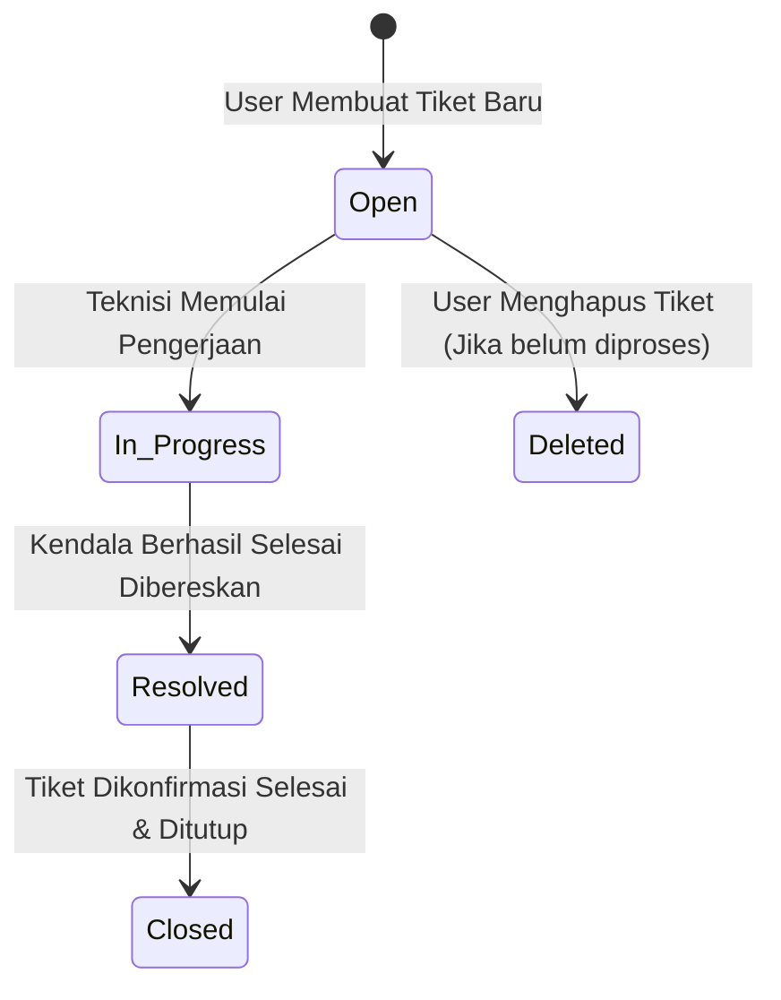

# 🎫 Helpdesk - IT Ticket Tracking System

[](https://laravel.com)
[](https://php.net)
[](https://tailwindcss.com)
[](https://alpinejs.dev)
[](LICENSE)

**Helpdesk & Ticket Tracking System** adalah aplikasi berbasis web yang dirancang untuk mengelola, melacak, dan menyelesaikan kendala teknis (IT Support) secara terstruktur di lingkungan organisasi atau perusahaan. Built with **Laravel 13**, aplikasi ini menerapkan arsitektur MVC (Model-View-Controller) dengan antarmuka yang modern, responsif, dan interaktif.

---

## 📸 Screenshot Tampilan Aplikasi

> [!TIP]
> **Slot Screenshot Tampilan:** Simpan gambar screenshot tampilan antarmuka aplikasi Anda di folder [`docs/screenshots/`](file:///c:/laragon/www/project-kerja-praktik/docs/screenshots/) dengan nama file sesuai panduan di bawah ini untuk menampilkan pratinjau secara otomatis.

| Tampilan Halaman | Tangkapan Layar (Screenshot) | Deskripsi |
| :--- | :---: | :--- |
| **Halaman Login & Authentikasi** |  | Form masuk pengguna berbasis role (Admin, Teknisi, User) |
| **Dashboard Pelapor (User)** |  | Ringkasan tiket milik karyawan, status terkini, dan statistik |
| **Form Buat Tiket Baru** |  | Pengisian detail kendala IT, kategori, tingkat urgensi & unggah foto |
| **Daftar & Status Tiket** |  | Tabel pencarian, filter status (`Open`, `In Progress`, `Resolved`, `Closed`) |
| **Detail Tiket & Diskusi** |  | Timeline riwayat pengerjaan, foto kendala, dan fitur balasan pesan |
| **Dashboard Teknisi / Admin** |  | Panel penanganan tiket masuk, klaim tiket, dan perbaruan status pengerjaan |
| **Ekspor & Cetak Laporan** |  | Modul pencetakan dokumen fisik laporan tiket kendala IT |

<details>
<summary>📍 <b>Petunjuk Cara Menambahkan Screenshot ke Proyek</b></summary>

1. Ambil tangkapan layar (_screenshot_) aplikasi Anda saat dijalankan di browser.
2. Simpan atau ubah nama file gambar ke salah satu nama berikut:
   - `login.png`
   - `dashboard-user.png`
   - `create-ticket.png`
   - `ticket-list.png`
   - `ticket-detail.png`
   - `dashboard-tech.png`
   - `export-print.png`
3. Letakkan file-file gambar tersebut ke dalam direktori [`docs/screenshots/`](file:///c:/laragon/www/project-kerja-praktik/docs/screenshots/).
4. Gambar akan langsung muncul menggantikan placeholder di atas saat README dilihat di GitHub/Repository Viewer.
</details>

---

## ✨ Fitur Utama

### 👥 1. Autentikasi & Multi-Role System
Aplikasi ini memiliki 3 hak akses pengguna (Role-Based Access Control):
- **User / Karyawan (Pelapor):**
  - Mengajukan tiket kendala IT baru dengan lampiran foto bukti.
  - Memantau perkembangan status tiket secara real-time.
  - Mengedit tiket yang masih berstatus `open`.
  - Berinteraksi dan memberi balasan pesan pada detail tiket.
  - Menghapus tiket yang belum diproses oleh teknisi.
- **Teknisi (IT Support):**
  - Melihat seluruh daftar tiket masuk dari berbagai departemen/karyawan.
  - Mengklaim/ditugaskan ke tiket tertentu.
  - Memperbarui status penanganan (`open` ➔ `in_progress` ➔ `resolved` / `closed`).
  - Memberikan catatan/solusi teknis melalui fitur balasan tiket.
  - Mengekspor & mencetak laporan penanganan tiket.
- **Administrator:**
  - Memiliki seluruh hak akses Teknisi.
  - Mengelola master data Pengguna & Kategori Kendala IT.
  - Melakukan penugasan (*assign*) teknisi untuk tiket tertentu.

### 🛠️ 2. Manajemen & Alur Tiket Interaktif
- **Auto Kode Tiket Unik:** Pembuatan kode tiket otomatis dengan format `TCK-YYYYMMDD-XXXX`.
- **Audit Log History (`TicketLog`):** Setiap aksi (pembuatan, perubahan status, balasan teknisi, perbaikan data) dicatat secara terurut dengan timestamp.
- **Unggah Lampiran Gambar:** Mendukung upload gambar bukti kerusakan/error dengan pratinjau interaktif.
- **Pencarian & Filter Pintar:** Filter berdasarkan status tiket, kategori masalah, serta pencarian judul/kode tiket.

---

## 🏗️ Arsitektur & Alur Data

Aplikasi dibangun menggunakan pola **MVC (Model-View-Controller)** berbasis Server-Side Rendering (SSR). Dokumentasi lengkap alur data dapat dibaca di [AlurData.md](file:///c:/laragon/www/project-kerja-praktik/AlurData.md).

```mermaid
graph TD
    A["🌐 Browser / User"] -->|1. HTTP Request| B["🛣️ Routes (routes/web.php)"]
    B -->|2. Cek Auth & Middleware Role| C["⚙️ Controller (app/Http/Controllers)"]
    C -->|3. Query / Manipulasi Data| D["🗄️ Model Eloquent (app/Models)"]
    D -->|4. Ambil Data DB| E["💾 Database SQLite/MySQL"]
    D -->|5. Return Data Objek| C
    C -->|6. Kirim Data ke View| F["🎨 Blade View (resources/views)"]
    F -->|7. Render HTML & CSS (Tailwind)| A
```

### 🔄 Siklus Status Tiket (Ticket Lifecycle)



---

## 📁 Struktur Direktori Utama Proyek

```text
project-kerja-praktik/
├── app/
│   ├── Http/
│   │   ├── Controllers/
│   │   │   ├── HomeController.php             # Beranda Utama Pengguna
│   │   │   ├── ProfileController.php          # Pengaturan Profil Pengguna
│   │   │   ├── User/
│   │   │   │   └── TicketController.php       # Controller CRUD Tiket oleh User
│   │   │   └── Tech/
│   │   │       └── TicketHandlingController.php # Controller Penanganan Tiket oleh Teknisi/Admin
│   │   └── Middleware/                        # Middleware Auth & Role Checking
│   └── Models/
│       ├── User.php                           # Model Data Pengguna & Hak Akses
│       ├── Category.php                       # Model Master Kategori Kendala IT
│       ├── Ticket.php                         # Model Utama Tiket Kendala
│       └── TicketLog.php                      # Model Catatan Riwayat & Diskusi Tiket
├── database/
│   ├── migrations/                            # Skema Tabel Database
│   └── seeders/
│       └── DatabaseSeeder.php                 # Seeder Data Pengguna Demo & Kategori
├── docs/
│   └── screenshots/                           # Slot Penyimpanan Gambar Screenshot App
├── resources/
│   └── views/                                 # Antarmuka Blade Templating (Tailwind + Alpine.js)
│       ├── layouts/                           # Layout App & Navigasi Sidebar
│       ├── user/                              # Halaman Pelapor (Index, Create, Show, Edit)
│       └── tech/                              # Halaman Teknisi & Admin
├── routes/
│   ├── web.php                                # Route Aplikasi & Grouping Middleware Role
│   └── auth.php                               # Route Autentikasi (Login/Register/Logout)
├── AlurData.md                                # Dokumentasi Detail Alur Data & CRUD
└── README.md                                  # Dokumentasi Proyek
```

---

## 🗄️ Skema Database & Relasi Model

| Tabel | Model Eloquent | Deskripsi & Relasi Utama |
| :--- | :--- | :--- |
| `users` | `User` | Menyimpan data akun (`role`: `user`, `technician`, `admin`). |
| `categories` | `Category` | Master data kategori kendala (Hardware, Software, Network, Akun, dll). |
| `tickets` | `Ticket` | Menyimpan tiket kendala. Relasi: `belongsTo(User)`, `belongsTo(Category)`, `hasMany(TicketLog)`. |
| `ticket_logs` | `TicketLog` | Catatan riwayat status, perbaikan, & percakapan antara pelapor dan teknisi. |

---

## 💻 Persyaratan Sistem

Sebelum menjalankan proyek ini, pastikan sistem Anda memenuhi kebutuhan berikut:
- **PHP** >= 8.5 (dengan ekstensi `pdo`, `mbstring`, `openssl`, `curl`)
- **Laravel Framework** v13.x
- **Composer** >= 2.x
- **Node.js** >= 18.x & **NPM**
- **Database Server** (MySQL, MariaDB, atau SQLite)
- **Laragon / XAMPP** (Opsional untuk lingkungan pengembangan Windows)

---

## 🚀 Panduan Instalasi & Penggunaan

Ikuti langkah-langkah berikut untuk menjalankan proyek di lingkungan lokal:

### 1. Clone Repository & Masuk ke Direktori
```bash
git clone https://github.com/username/project-kerja-praktik.git
cd project-kerja-praktik
```

### 2. Install Dependensi PHP & JavaScript
```bash
composer install
npm install
```

### 3. Salin Environment File & Generate App Key
```bash
cp .env.example .env
php artisan key:generate
```

### 4. Konfigurasi Database pada `.env`
Sesuaikan pengaturan database di file `.env` (misalnya MySQL atau SQLite):
```env
DB_CONNECTION=mysql
DB_HOST=127.0.0.1
DB_PORT=3306
DB_DATABASE=helpdesk_db
DB_USERNAME=root
DB_PASSWORD=
```

### 5. Jalankan Migrasi & Seeder Database
Jalankan perintah ini untuk membuat tabel dan menginput data awal (kategori & akun testing):
```bash
php artisan migrate:fresh --seed
```

### 6. Buat Symbolic Link untuk Storage File
Diperlukan agar gambar lampiran tiket yang diunggah pengguna dapat diakses di publik:
```bash
php artisan storage:link
```

### 7. Jalankan Server Pengembang
Buka dua terminal dan jalankan perintah berikut:

**Terminal 1 (Laravel Development Server):**
```bash
php artisan serve
```

**Terminal 2 (Vite Assets Bundler):**
```bash
npm run dev
```

Akses aplikasi di browser pada alamat: `http://127.0.0.1:8000`

---

## 🔑 Akun Uji Coba (Default Seeder Accounts)

Setelah menjalankan `php artisan db:seed`, Anda dapat langsung login menggunakan akun demo berikut:

| Role Pengguna | Email | Password | Hak Akses & Deskripsi |
| :--- | :--- | :--- | :--- |
| **Administrator** | `admin@helpdesk.com` | `password123` | Akses penuh seluruh sistem, manajemen user & kategori |
| **Teknisi 1 (Hardware)** | `budi.tech@helpdesk.com` | `password123` | Penanganan tiket kendala perangkat keras |
| **Teknisi 2 (Jaringan)** | `siti.tech@helpdesk.com` | `password123` | Penanganan tiket kendala jaringan & internet |
| **User (Staf Operasional)** | `andi@helpdesk.com` | `password123` | Pelapor kendala IT |
| **User (Staf Keuangan)** | `dewi@helpdesk.com` | `password123` | Pelapor kendala IT |

---

## 📄 Lisensi

Proyek ini dikembangkan untuk kebutuhan Kerja Praktik / Sistem Internal dan dilindungi di bawah lisensi [MIT License](LICENSE).
